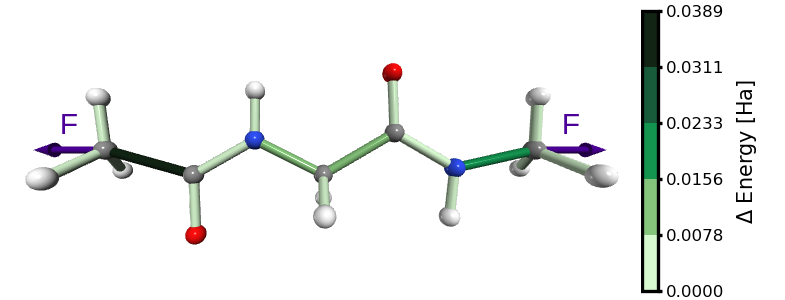

.. SITH documentation master file, created by
   sphinx-quickstart on Fri Aug 26 12:18:30 2022.

SITH
####

**Citation**: SITH: A quantum-chemical framework for predicting bond destabilization in stretched molecules

Daniel Sucerquia, Mikaela Farrugia, Benedikt Rennekamp, Andreas Dreuw, Frauke Gräter

`10.1063/5.0325167 <https://doi.org/10.1063/5.0325167>`_

.. code-block:: bibtex

   @article{sucerquia2026sith,
     title={SITH: A quantum-chemical framework for predicting bond destabilization in stretched molecules},
     author={Sucerquia, Daniel and Farrugia, Mikaela and Rennekamp, Benedikt and Dreuw, Andreas and Gr{\"a}ter, Frauke},
     journal={The Journal of Chemical Physics},
     volume={164},
     number={23},
     year={2026},
     publisher={AIP Publishing}
   }

SITH is a novel method that decomposes the total electronic energy change of a
stretched molecule into contributions from individual degrees of freedom —such
as bond lengths, angles, and dihedrals— using numerical integration of the
work-energy theorem,

.. math::
   :label: eq:numerical_integration

   \Delta E_i = - \int_{0}^{k} F_i \, dq_i
   \approx - \sum_{j=0}^{k} \frac{F^j_i + F^{j+1}_i}{2} \Delta_j^{j+1} q_i,

where :math:`\Delta_j^{j+1} q_i` is the change of the value of the :math:`i`-th degree of
freedom between two consecutive configurations in the COGEF path. :math:`F^j_i` is
the force associated to the i-th degree of freedom for the j-th configuration
in the path,

.. math::
   :label: eq:force_i

   F^j_i = -\frac{\partial E^{DFT}}{\partial q_i}\bigg|_{\{q\}^j}.

SITH software is organized as follows:

.. include:: flowchart.rst

Contents
========

.. toctree::
   :maxdepth: 3
   :name: contents

   install
   workflow/workflow
   modules/sith
   tutorials/tutorials

* :ref:`genindex`

